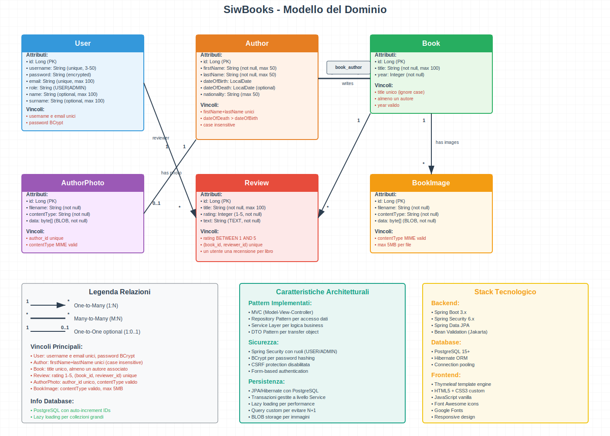

# SiwBooks

Una semplice applicazione Spring Boot per gestire una raccolta di libri.

## 📖 Descrizione

SiwBooks è un progetto basato su Spring Boot che fornisce:
- CRUD (Create, Read, Update, Delete) per entità **Book** ( tramite l'admin)
- CRUD (Create, Read, Update, Delete) per entità **Autore** ( tramite l'admin)
- CRUD (Create, Read, Update) per entità **Recensioni** ( tramite l'admin)
- Frontend minimale in Thymeleaf (opzionale)

## 🚀 Funzionalità Principali

1. **Elenco libri** – vedi tutti i libri registrati  
2. **Aggiungi libro** – crea un nuovo record con titolo,autore, data di pubblicazione , 1 o piu imagini .
3. **Aggiungi autore** - crea un nuovo record con nome , cognome , 1 imagine ,  data di nascita e data di morte .
4. **Elenco autori** - vedi tutti autori
5. **Elimina autore** - rimuovi un autore
6. **Aggiungi Recensione** - crea una nuovo recensione per un libro
7. **Elimina Recensione** - rimuovi tramite l'admin una recensione di un libro
8. **Elenco Recensioni** - vedi tutte le recensioni 
9. **Modifica libro** – aggiorna i dettagli di un libro esistente  
10. **Elimina libro** – rimuovi un libro dalla collezione  
11. **Ricerca** – cerca libri per autore o titolo , cerca anche autore tramite nome 

## 🛠️ Tecnologie

- Java 21  
- Spring Boot  3.3.o 
- Spring Data JPA  
- Thymeleaf     
- PostgreSQL (configurabile)  
- Maven  
- Bootstrap 5.3.3

## 📋 Prerequisiti

- JDK 17+ installato  
- Maven installato  
- (Opzionale) Pgadmin se vuoi persistere i dati su DB esterno

## ⚙️ Installazione e Avvio

1. **Clona il repository**  
   ```bash
   git clone https://github.com/pazo01/SiwBooks.git
   cd SiwBooks


## 📖 Siw Books Casi d'uso : 

Utente Anonimo:

UC1: **Navigazione Pubblica** - Accesso a libri, autori e recensioni

UC2: **Registrazione** - Creazione nuovo account con validazioni

UC3: **Login** - Autenticazione con reindirizzamento basato su ruolo

Utente Registrato (USER):

UC4: **Gestione Recensioni** - Creazione recensioni con vincolo di unicità

UC5: **Logout** - Terminazione sessione

Amministratore (ADMIN):

UC6: **Gestione Libri** - CRUD completo con gestione immagini

UC7: **Gestione Autori** - CRUD con foto e associazioni libri

UC8: **Moderazione Recensioni** - Eliminazione recensioni inappropriate

UC9: **Dashboard Amministrativa** - Visualizzazione statistiche


## Modello del Dominio

<div align="center">
  <!-- File in radice -->
  

  <!-- Se invece lo metti in docs/: -->
  <!--  -->
</div>


